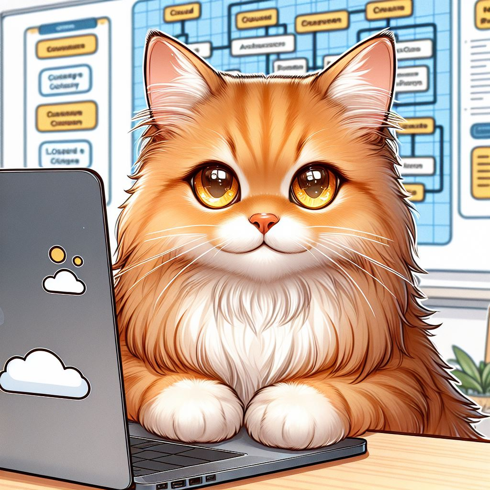

# Feline Flavors Deli

 
 
Image generated using Bing AI.

Welcome to a narrative learning journey, where you are tasked with helping an entrepreneurial feline in building his cat snacks retail empire named Feline Flavors Deli.

The goal is to learn basics of GCP, while helping Eppu the Siberian Cat to launch his online business.

You will navigate challenges of building your own Google Cloud Platform infrastructure with Terraform. Each lesson is in a form of a small episode - the episode contains a common cloud architecture scenario, in which you will familiarize yourself with the components needed to build a standard solution.

Rather than a tutorial, it is a series of signposts to point you in the right direction, so keep Terraform and GCP documentation close by to search for the right answers on how to solve the problems ahead of you.

The Feline Flavors Deli Chief Cat Engineer will provide you with the outlines and tips and you will fill in the blanks, by configuring the resources 🐾 

# Requirements 
Basic programming knowledge and understanding of cloud concepts will help you to get the most out of this journey.
- [GCP account](https://cloud.google.com/)
- [gcloud CLI](https://cloud.google.com/sdk/gcloud)
- [Terraform](https://developer.hashicorp.com/terraform/tutorials/aws-get-started/install-cli)

You also will need your own GCP project, in which you will create your resources. You can learn more about projects [here](https://cloud.google.com/resource-manager/docs/creating-managing-projects).

Note that creating resources might incur costs. Read the GCP pricing policy [here](https://cloud.google.com/pricing). 

# How to navigate 
Each lesson is contained in a short episode, in which Fancy Feline Deli is facing a digital transformation challenge.

You can find the episodes in the `Episodes` folder. The episodes are independent, but is recommended to follow the numerical order, starting from ep00 (pilot). Each episode is a bit more difficult than the previous one.

Each episode has an introductory short story, which will tell you more about the challenge you will be solving and where did it come from, as well as a `Theory` part, which introduces you to the relevant Google Cloud resources.

In `What do I need to do?` part, you will find tips on how to complete the solution. The terraform source codes contains more explanations and tips on how to proceed.
`What did I learn?` lists the concepts you should be comfortable with after deploying the solutions.
In `🐾 Special treats 🐾` you will find additional information and extra challenges, in case you want do more.

## List of episodes
00. [Pilot](/episodes/ep-00-pilot/)
01. [Static web page](/episodes/ep-01-static-page/)

# Backstory (by ChatGPT)

Once upon a time in a quaint town, there lived a bright-eyed and bushy-tailed orange Siberian cat named Eppu. Eppu wasn't your ordinary feline; he was a visionary, an entrepreneurial cat with dreams as big as his love for treats.

Eppu's days were filled with crafting the most delectable cat snacks in his cozy kitchen. His Feline Flavors Deli had become a local sensation, drawing cats from all corners of the neighborhood to indulge in his flavorful creations. Yet, Eppu harbored dreams beyond the town's borders.

One day, as Eppu basked in the sun, a thought struck him like a lightning bolt – why not share his culinary delights with cats around the world? The idea ignited a fire in his whiskers, and Eppu knew he needed more than just a chef's hat; he needed the power of technology.

Enter Google Cloud Platform, the key to Eppu's global dreams. With GCP's scalable infrastructure and advanced analytics, Eppu could manage his business seamlessly. The cloud became his kitchen assistant, helping him analyze customer preferences, streamline orders, and ensure every cat received their treats promptly.

As Eppu embraced the digital transformation, his cat snack empire began to soar. Orders poured in from distant lands, and cats everywhere reveled in the joy of Feline Flavors Deli. The heartwarming success story of a little cat with big dreams had become a worldwide sensation.

Eppu, the entrepreneurial orange Siberian cat, proved that with a sprinkle of ambition and a dash of technology, dreams could leap beyond the cozy confines of a kitchen to touch the hearts – and taste buds – of cats worldwide. And so, under the virtual canopy of the cloud, Eppu's journey continued, one paw at a time, leaving a trail of satisfied purrs in its wake.

# Disclaimer 

AI generated content is used sporadically and labeled as such, either with a comment in code or by a remark in text. 
Code pulled from other sources is credited in the comments.

If there is otherwise no disclaimer, the content is created by me, Nicole :)